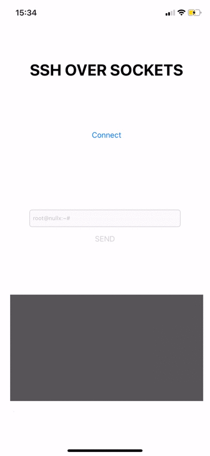

# Listener side-to-side
Simple example of implementation of sockets working as a SSH client

## Table of contents
1. [Server setup](#server-setup)
2. [IOS Client setup](#ios-client-setup)
3. [Demo screenshots](#screenshots)
## Server setup
  - Download client/ folder
  - Do `npm install --save` inside downloaded folder (you need npm to be installed first)
  - Replace the port with yours.
  - To run server: `node listener.js` (you need to install nodejs first)
  - Your socket endpoint will be: `http://your_ip:your_port`
## IOS Client setup
  - Download iosClient/ folder
  - Do `pod install` inside downloaded folder (you need to be installed cocoapods first)
  - Implement your project with `Listener.swift` and `Main.storyboard` files
  - Replace inside `Listener.swift` `socketURL` with your `http://your_ip:your_port`

## Screenshots

